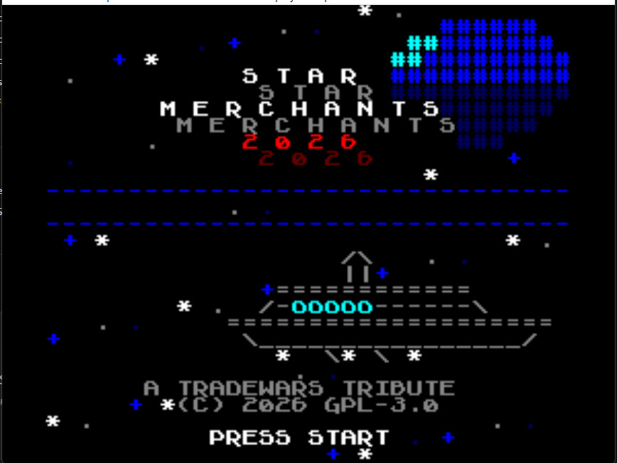
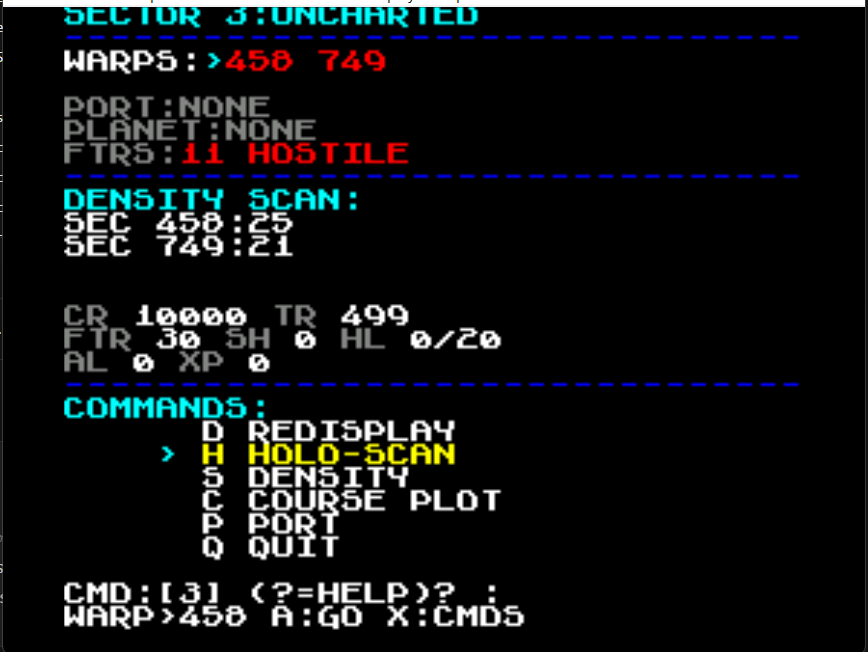
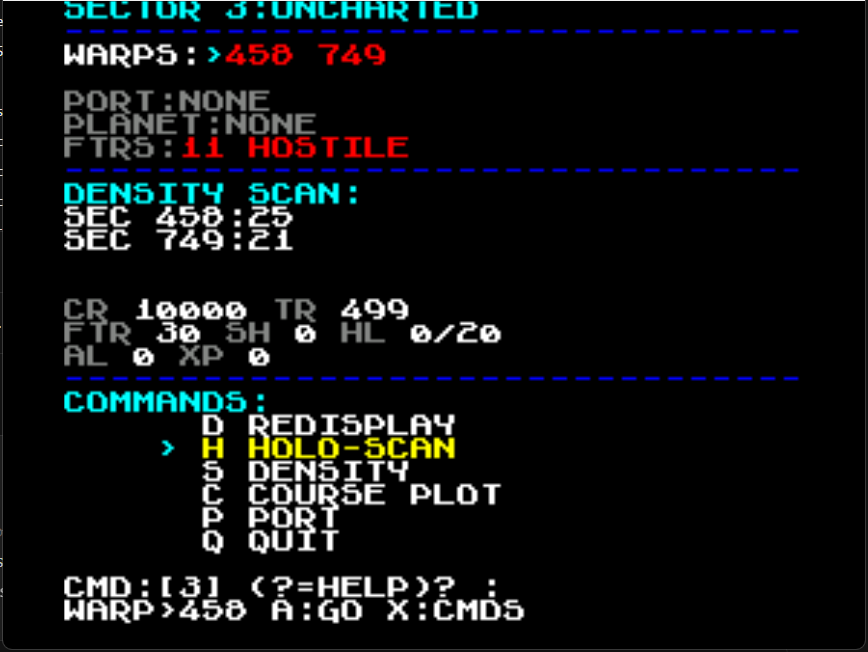
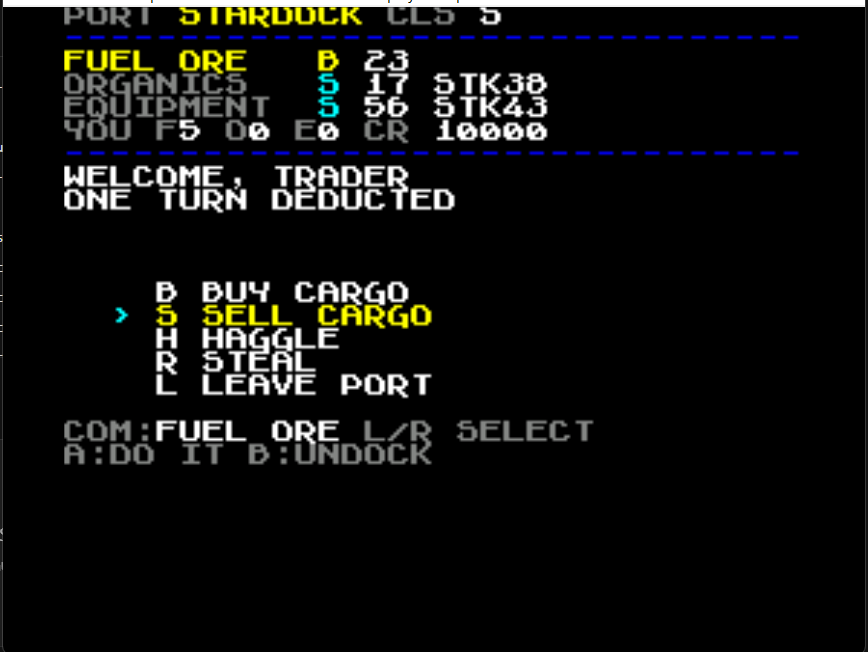
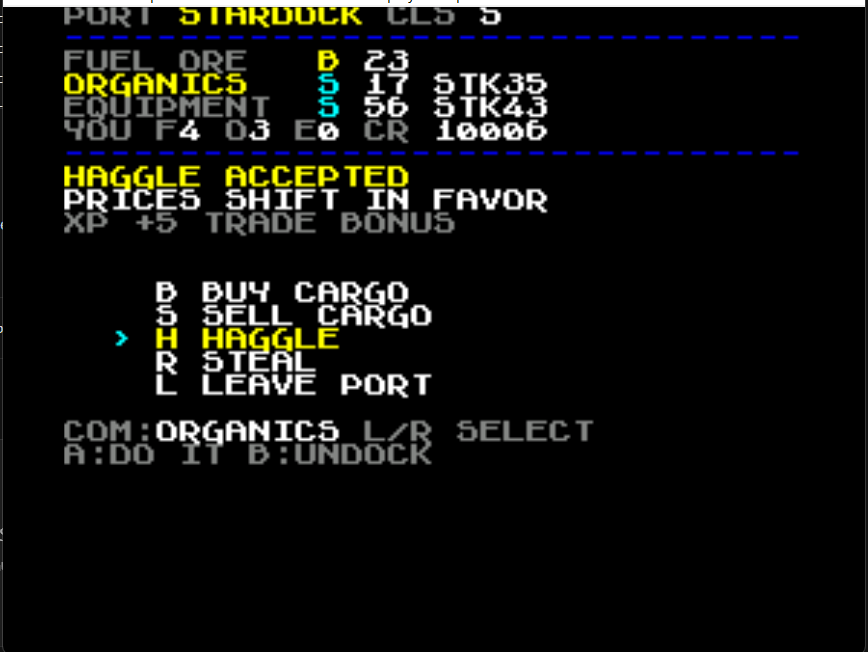
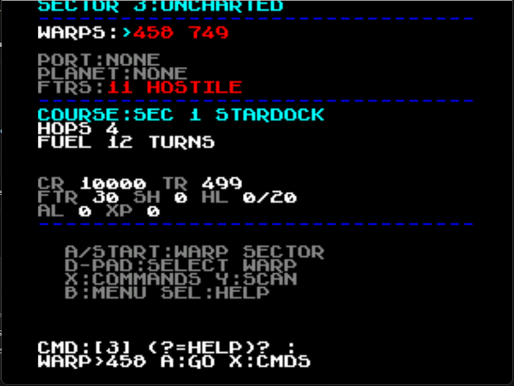
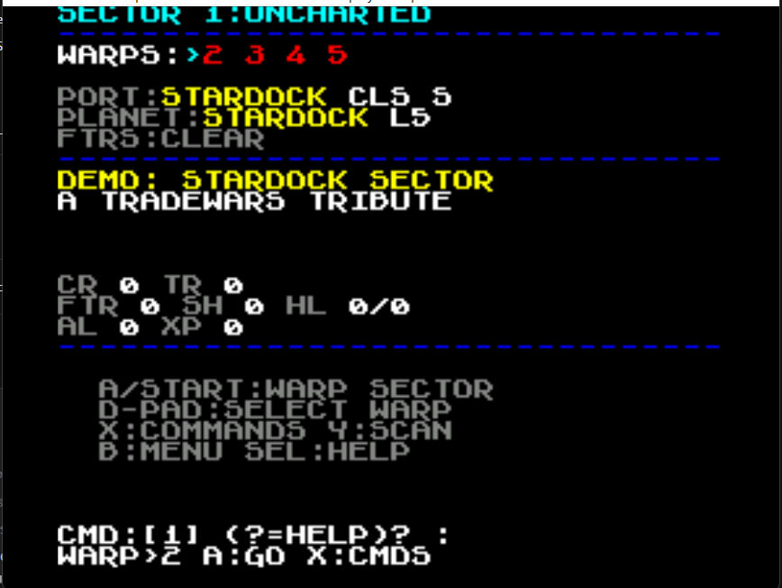
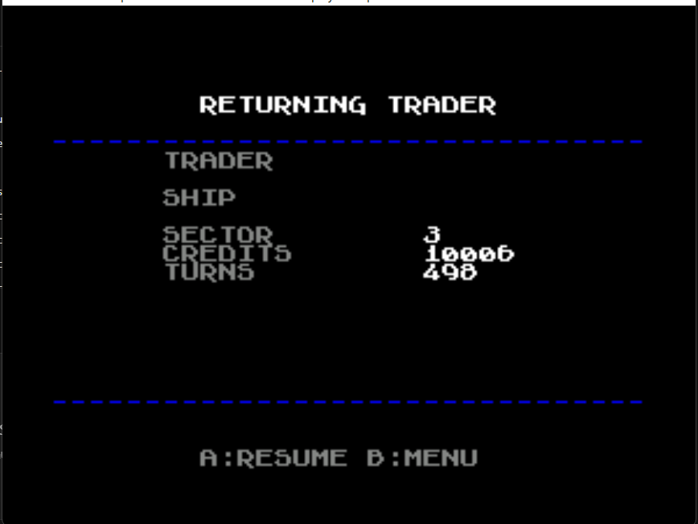

# Star Merchants for Super Nintendo
A VibeBrew "spiritual successor" of the old BBS game Tradewars 2002.

## Screenshots

All captures are real emulator screenshots (snes9x) of the actual ROM.

| Title screen | Sector view (warped to Sector 3) |
|---|---|
|  |  |
| ANSI starfield, planet, freighter, blinking PRESS START | Warps (red = unvisited), port/planet/ftrs, status bar, CMD prompt |

| Command palette + warp | Starport trading |
|---|---|
|  |  |
| Warp to sector 3, palette open on HOLO-SCAN, density results | Class S port table: S/B side letters, prices, stocks, cargo |

| Haggle + economy | Course plotter |
|---|---|
|  |  |
| Haggle accepted (+5 XP); status shows the reconciled trade economy | HOPS 4 / FUEL 12 TURNS back to Stardock |

| Attract mode | Continue / SRAM resume |
|---|---|
|  |  |
| 10s idle plays a Stardock sector demo | Save → warp → Continue round-trip restores sector, credits, turns |

## Current Status

Milestones 0–4 complete and screenshot-verified: ANSI title + attract
mode, main menu + new-game wizard, sector view (warp nav, density/holo
scans, command palette, course plotter), starport trading (buy/sell/
haggle/steal), and SRAM save/load with Continue resume. See
`MILESTONES.md` for the roadmap, `AGENTS.md` and `devlog/` for the full
technical state.

Currently working **Milestone 5: Stardock (Central Hub)** —
see `MILESTONES.md` for the roadmap.

## Quick Start

```powershell
& "scripts\build.ps1" -Run      # build, validate, launch in Mesen-S
& "scripts\build.ps1" -Clean    # clean build dir
python tools\verify_rom.py build\starmerchants.sfc   # standalone ROM validation
```

Requires cc65 at `C:\cc65`. The emulator of record is **Mesen-S** at
`C:\dev\snes\tools\mesen-s\Mesen-S.exe` (note: regular Mesen 0.9.9 is
NES-only and cannot load `.sfc` files).

## Documentation Map

| File | Contents |
|------|----------|
| `AGENTS.md` | Agent/handoff instructions: verified facts, workflow, current status |
| `devlog/` | Session-by-session technical history (read before touching anything) |
| `MILESTONES.md` | Roadmap + TradeWars 2002 design reference |
| `scripts/build.ps1` | Build script with emulator-exact ROM validation |
| `tools/verify_rom.py` | Standalone Mesen-S header-scoring port (Python) |
