# Star Merchants for Super Nintendo
A VibeBrew "spiritual successor" of the old BBS game Tradewars 2002.

## Screenshots

All captures are real emulator screenshots (snes9x) of the actual ROM.

| Title screen | Sector view (warped to Sector 3) |
|---|---|
| 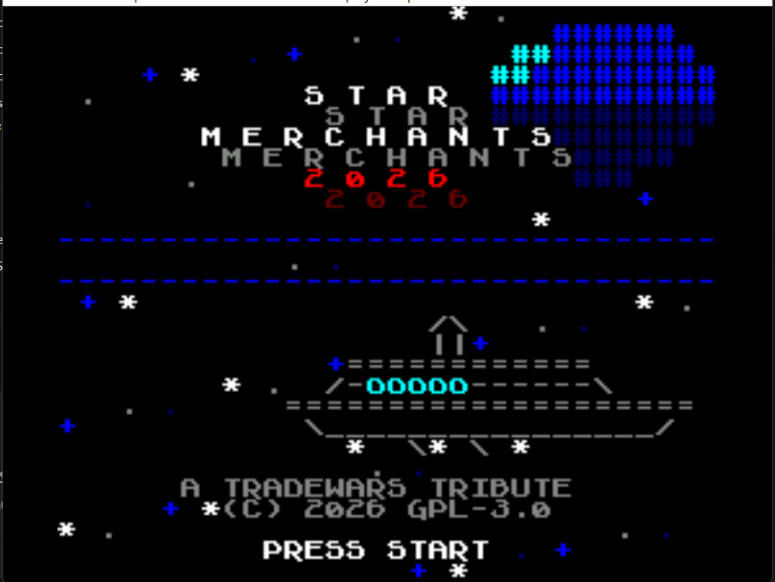 | 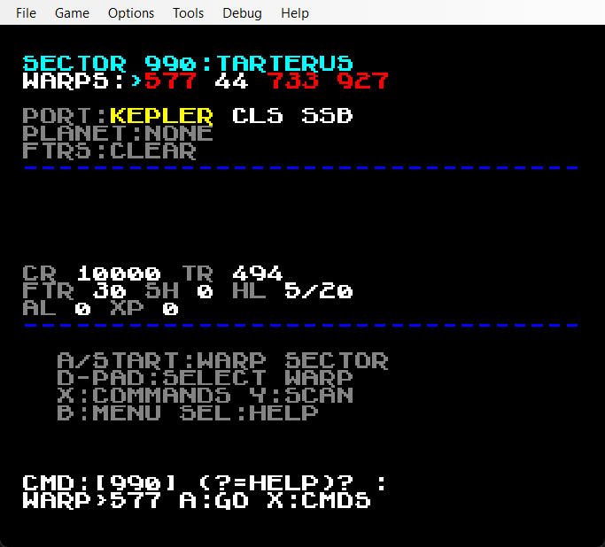 |
| ANSI starfield, planet, freighter, blinking PRESS START | Sector 990: white visited warp, port/planet/ftrs, status bar, CMD prompt |

| Command palette + warp | Starport trading |
|---|---|
| 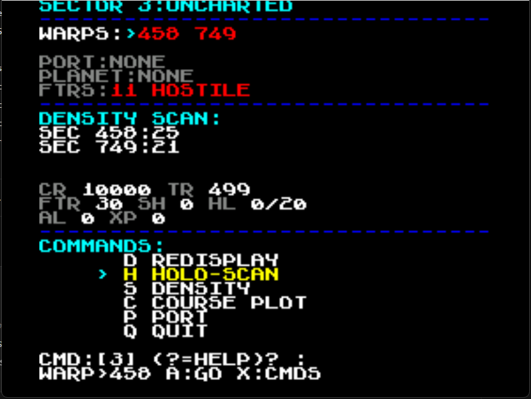 | 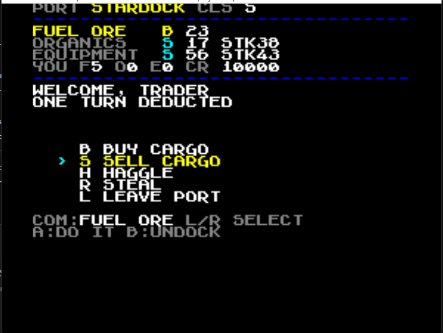 |
| Warp to sector 3, palette open on HOLO-SCAN, density results | Class S port table: S/B side letters, prices, stocks, cargo |

| Haggle + economy | Course plotter |
|---|---|
| 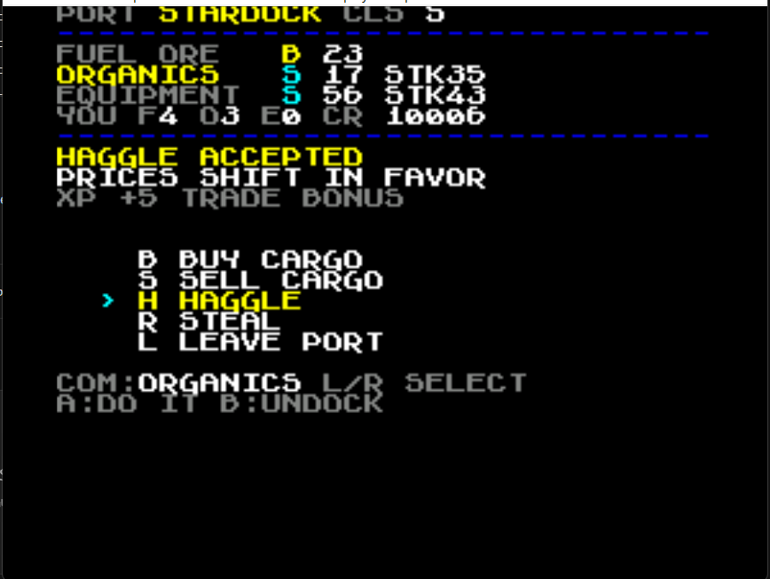 | 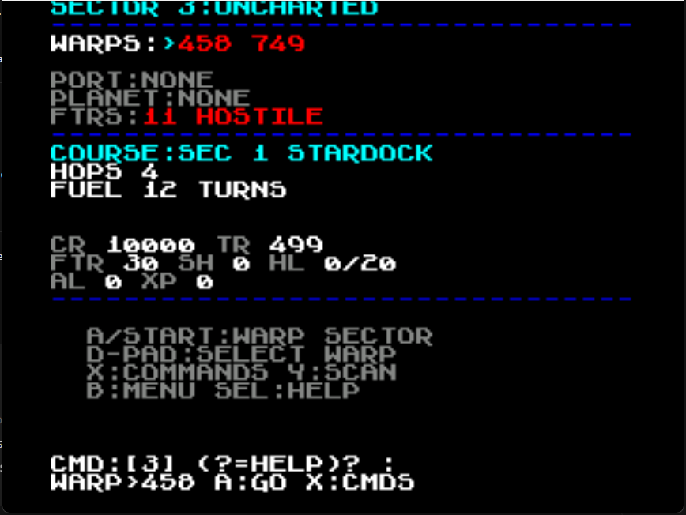 |
| Haggle accepted (+5 XP); status shows the reconciled trade economy | HOPS 4 / FUEL 12 TURNS back to Stardock |

| Attract mode | Continue / SRAM resume |
|---|---|
| 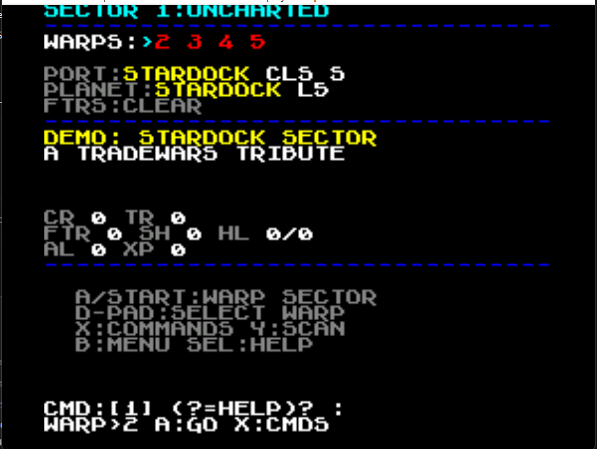 | 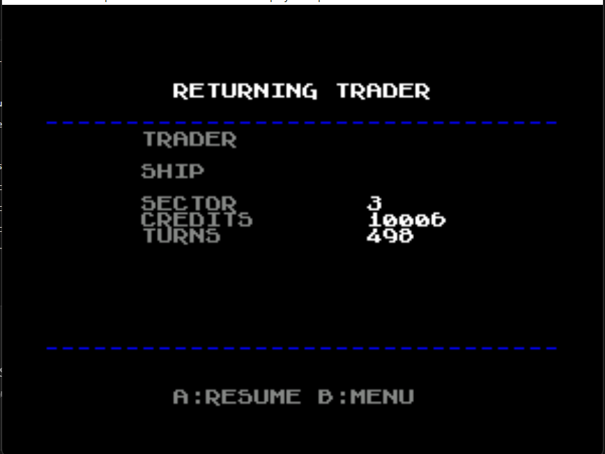 |
| 10s idle plays a Stardock sector demo | Save → warp → Continue round-trip restores sector, credits, turns |

| Planet management | Quasar cannon |
|---|---|
| 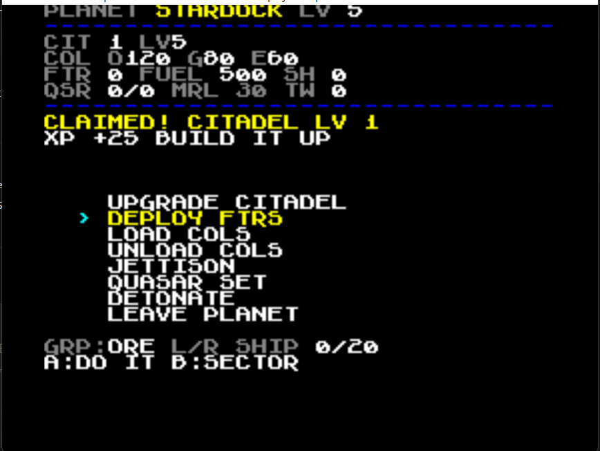 | 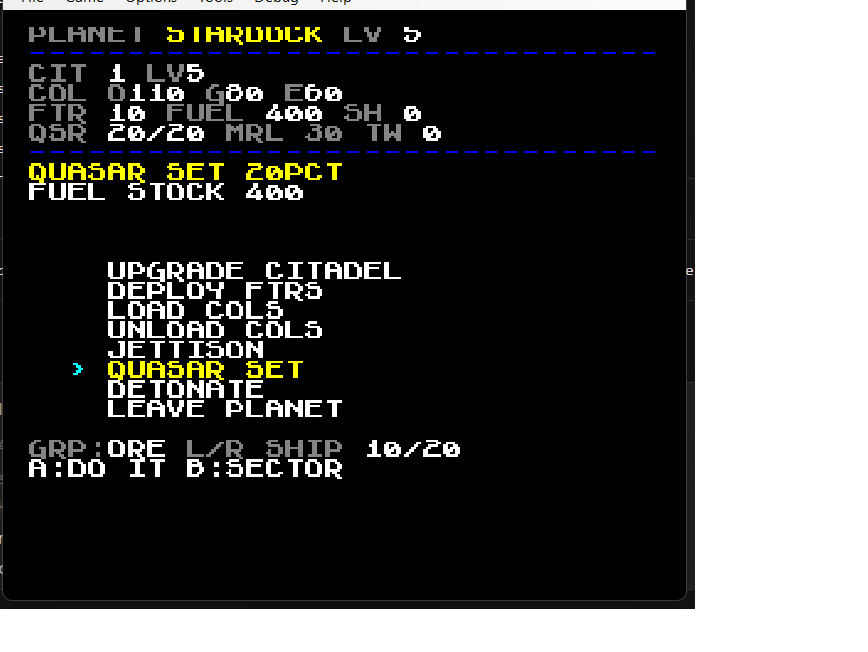 |
| Claimed homeworld: citadel, colonists, fighters, 8 commands | Quasar set 20%, fuel stock decremented, economy reconciled |

| Ferrengi tribute | Ferrengi combat |
|---|---|
| 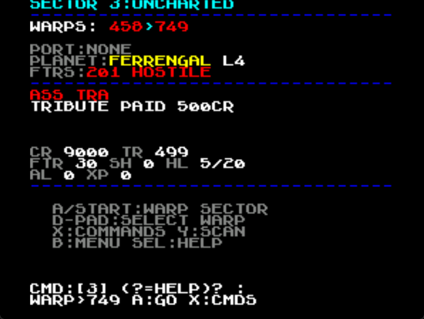 | 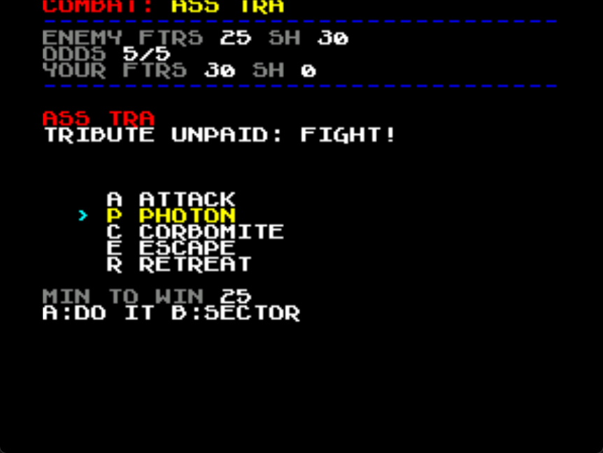 |
| Ferrengal L4 / 201 fighters; ASS TRA demands 500cr, paid (CR 9000) | Unpaid: ASS TRA 5/5 odds, photon blinds (MIN TO WIN 25→12) |

| Corporation: ship exchange |
|---|
| 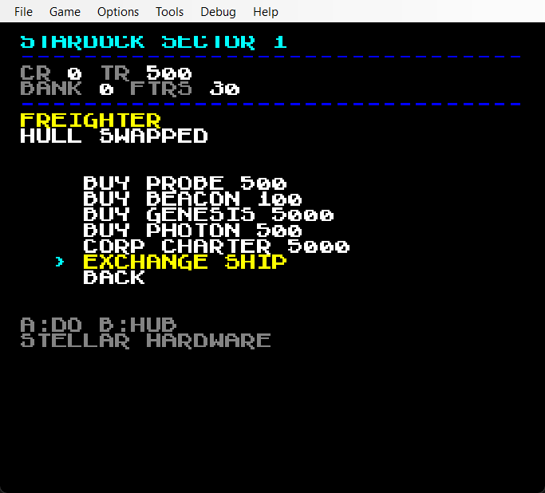 |
| Stardock Hardware: FREIGHTER / HULL SWAPPED (CR 0), charter + exchange rows intact |

| Explored universe persists |
|---|
| 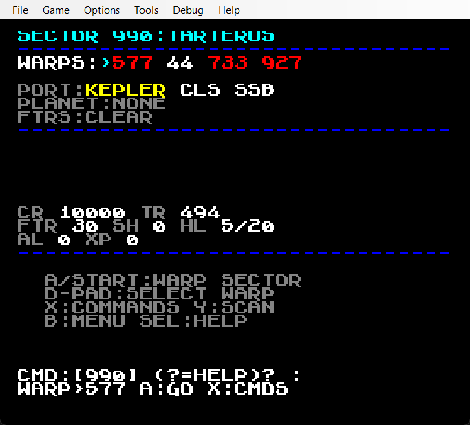 |
| Sector 990 after Continue → Resume: visited warp 44 renders white, rest red |

| Universe seed entry | Seeded universe |
|---|---|
| 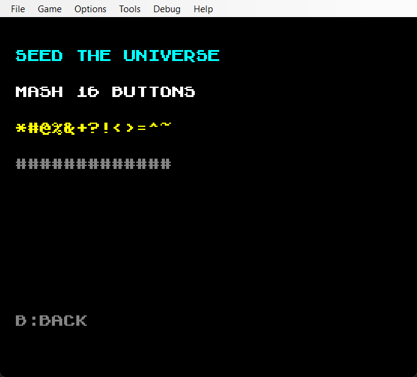 | 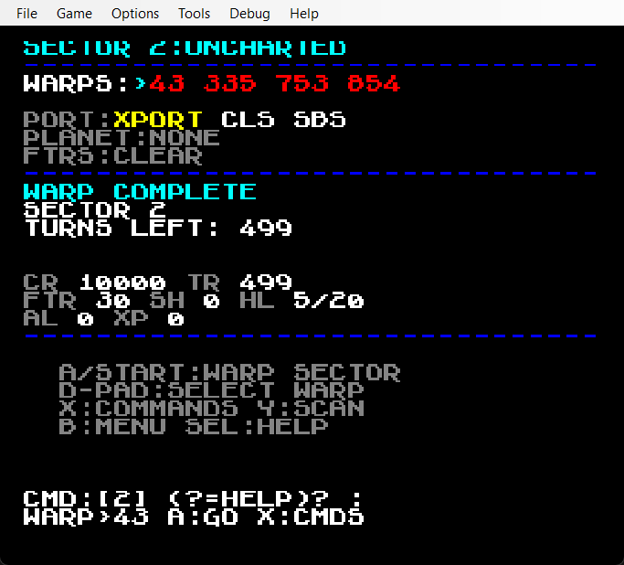 |
| Mash 16 buttons: glyph cells + weave bar fill per press (B backs out) | Same new-game flow, seed 2426: sector-2 warps 43/335/753/854 |

## Current Status

Milestones 0–6 complete and screenshot-verified: ANSI title + attract
mode, main menu + new-game wizard, sector view (warp nav, density/holo
scans, command palette, course plotter), starport trading (buy/sell/
haggle/steal), Stardock hub (shipyard, hardware, bank, police,
underground, tavern), planet management (citadels, colonists, quasar,
genesis/detonator), and SRAM save/load with Continue resume. See
`MILESTONES.md` for the roadmap, `AGENTS.md` and `devlog/` for the full
technical state.

**Milestones 7–8 complete 2026-09-28**: combat system (15 ship classes,
photon blind, corbomite/escape-pod paths, turn clamps) and Ferrengi &
Aliens (Ferrengal L4 colony, 3 ship classes, tribute/grudge system,
neutralization rules, alien ranks with alignment shifts). The M7
rollback of 2026-09-24 (bank-1 rodata pragma garbling text) is ancient
history — see `devlog/` for that and the M8 bank-1-code root causes
(cross-bank JSR, asm X-discipline). Host suite 54/54, ROM builds with
Mesen-S-exact validation.

**Milestone 9 complete 2026-10-01**: Corporation (lean single-player
core) — Stardock-Hardware charter (5000cr) + 4-hull exchange with
cargo-fit gate (no megaholds exploit by design), fighter overflow
pool, SRAM v7. Host suite 74/74, screenshot-verified in Mesen-S and
snes9x. Bank-0 is byte-full — M10 needs a budget first.

**Milestone 10 slice complete 2026-10-02**: explored-universe
persistence — visited-sector bitmap saved in SRAM v8, white warps
survive Continue/resume (host 83/83, Mesen-S + snes9x verified).

**Milestone 10 slice complete 2026-10-02**: universe seed — 16-button
mash entry (glyph cells + weave bar) mixed into sector generation,
SRAM v9 (host 86/86, Mesen-S + snes9x verified). Next: more M10
slices (victory, Hall of Fame, animations, bug fixes, options,
cartridge).

## Quick Start

```powershell
& "scripts\build.ps1" -Run      # build, validate, launch in Mesen-S
& "scripts\build.ps1" -Clean    # clean build dir
python tools\verify_rom.py build\starmerchants.sfc   # standalone ROM validation
```

Requires cc65 at `C:\cc65`. The emulator of record is **Mesen-S** at
`C:\dev\snes\tools\mesen-s\Mesen-S.exe` (note: regular Mesen 0.9.9 is
NES-only and cannot load `.sfc` files).

## Documentation Map

| File | Contents |
|------|----------|
| `AGENTS.md` | Agent/handoff instructions: verified facts, workflow, current status |
| `devlog/` | Session-by-session technical history (read before touching anything) |
| `MILESTONES.md` | Roadmap + TradeWars 2002 design reference |
| `scripts/build.ps1` | Build script with emulator-exact ROM validation |
| `tools/verify_rom.py` | Standalone Mesen-S header-scoring port (Python) |
